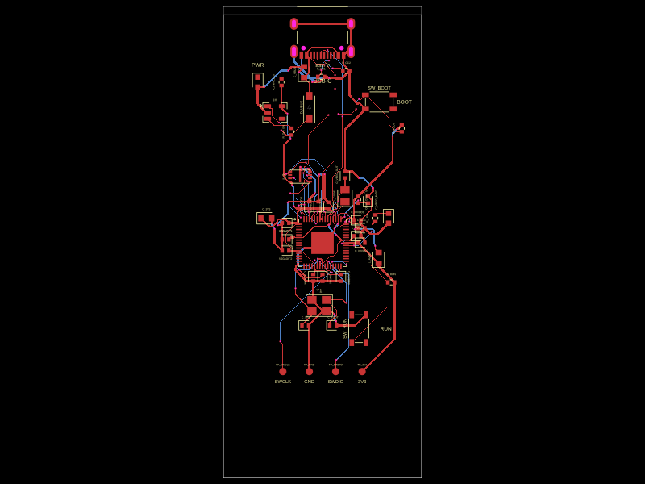
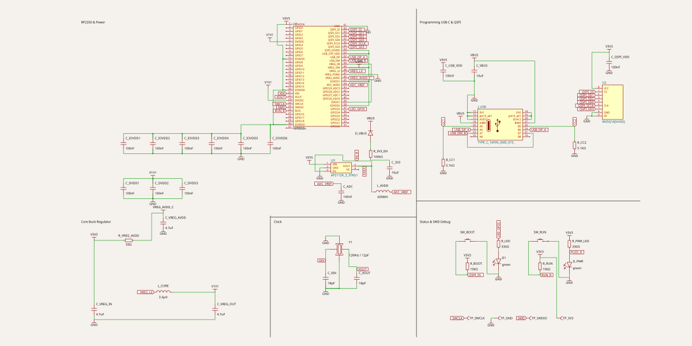

# rp2350

A complete, Pico 2-style **RP2350A** microcontroller module built with
[tscircuit](https://tscircuit.com): USB-C programming port, QSPI flash, 12 MHz
crystal, BOOTSEL/RUN buttons, status LEDs, and SWD test points.

It is a direct counterpart to the physically validated `Microcontroller_RP2040`
module in [`@tscircuit/common`](https://github.com/tscircuit/common) — same
30 x 70 mm board, same floorplan, same net names — with the RP2040-specific
power section swapped for the RP2350's on-chip buck converter.

> ⚠️ This board has **not** been fabricated or physically validated yet. The
> RP2040 module it is derived from has been. Review before ordering.

## Snapshots

| PCB | Schematic |
| --- | --- |
|  |  |

## Usage

```tsx
import { Microcontroller_RP2350 } from "@tsci/tscircuit.rp2350"

export default () => (
  <board width="30mm" height="70mm" autorouter="auto_local">
    <Microcontroller_RP2350
      name="MCU"
      connections={{ GPIO0: "net.USER_IO" }}
    />
  </board>
)
```

`Microcontroller_RP2350` is a pure `<subcircuit />` — it renders no `<board />`
of its own, so it can be placed inside a larger design with `pcbX` / `pcbY` /
`pcbRotation` and `schX` / `schY`. Any `connections` you pass are forwarded to
the RP2350A chip, so GPIOs can be wired by name.

### Rails

| Net | Source |
| --- | --- |
| `VBUS` | USB-C `VBUS` |
| `VSYS` | `VBUS` through the `B5819W` reverse-protection diode |
| `V3V3` | AP2112K-3.3 LDO from `VSYS` |
| `V1V1` | RP2350 on-chip buck converter (`VREG_LX` → `L_CORE` → `V1V1`) |
| `ADC_VREF` | `V3V3` through a 600 Ω @ 100 MHz ferrite bead |
| `GND` | ground |

## Differences from the RP2040 module

- **Core rail.** The RP2040 has a linear core regulator (`VREG_IN`/`VREG_VOUT`
  with a single 1 µF cap). The RP2350 has a switching buck converter, so this
  module adds `L_CORE` (3.3 µH), `C_VREG_IN`/`C_VREG_OUT` (4.7 µF), and an
  RC-filtered `VREG_AVDD` feed (33 Ω + 4.7 µF) taken from `V3V3`.
- **Extra supply pins.** The RP2350A has `DVDD3`, `QSPI_IOVDD`, and
  `USB_OTP_VDD` on top of the RP2040's supply pins. Each gets its own 100 nF
  decoupler placed next to its pin.
- **No USB series resistors.** The RP2040 module uses 27 Ω series resistors on
  `USB_DM`/`USB_DP`. The RP2350 USB PHY has on-chip series termination, so
  `USB_DM`/`USB_DP` run straight from the connector to the chip, matching the
  Raspberry Pi Pico 2 reference design.
- **SWD test points** moved from y = -31 mm to y = -19 mm so that every ground
  pad has a ground neighbour within the autorouter's crystal-net length limit.

## Development

```bash
bun install
```

```bash
bun run dev
```

```bash
bun test
```

Regenerate the PCB and schematic snapshots after any layout change:

```bash
bun run snapshot:update
```

Check them without writing (this is what CI runs):

```bash
bun run snapshot
```

## Bill of materials

Every part carries a JLCPCB part number via its import in
`lib/Microcontroller_RP2350/imports/`, so the module is assembly-ready:

| Ref | Part | Note |
| --- | --- | --- |
| U1 | RP2350A (C42411118) | QFN-60, 7 x 7 mm |
| U2 | W25Q16JVUXIQ | 16 Mbit QSPI flash |
| U3 | AP2112K-3.3TRG1 | 600 mA 3.3 V LDO |
| J_USB | TYPE-C-16PIN-2MD-073 | USB-C receptacle |
| Y1 | X322512MSB4SI | 12 MHz crystal |
| L_CORE | 3.3 µH 0805 | buck inductor |
| L_AVDD | 600 Ω @ 100 MHz 0603 | ADC supply ferrite |
| SW_BOOT / SW_RUN | SKRPACE010 | tactile buttons |
| D_VBUS | B5819W SL | Schottky |
| D1 / D_PWR | XL-1608SURC-06 | status LEDs |
